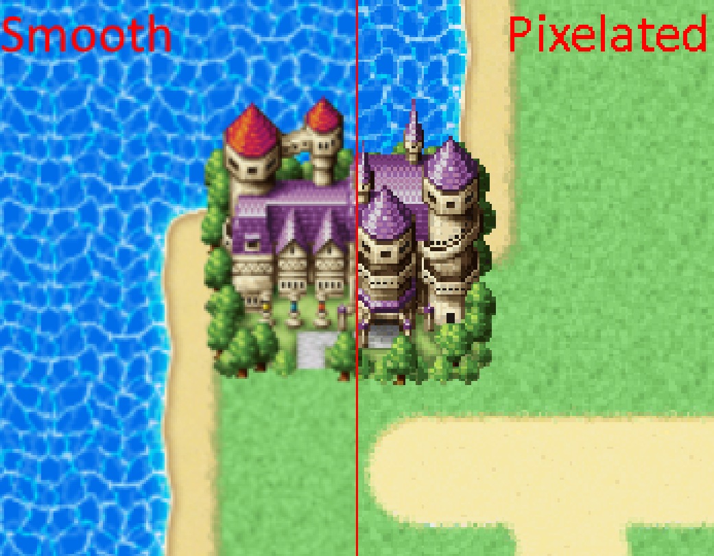
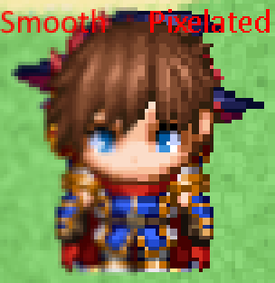

# N_Pixelate
Disables smoothing to make graphics look pixelated.

  

**Notes**:
- (New in 1.1.0) Hybrid pixelation
  - Pixelation can look problematic when the game's window is smaller than the game's resolution.
  - This option automatically disables pixelation when the game's window is smaller than the game's resolution.
  - Detects window resize events and enables/disables pixelation accordingly.
  - This option is OFF by default.

| Project    | Latest release      |
| ---------- | ------------------- |
| N_Pixelate | [Download][release] |

[All RPG Maker plugins by Nolonar][hub]

## Compatibility
Tested and confirmed working:
- RPG Maker MV ([1.0.0][release_1_0_0] only; newer versions might work, but are untested)
- RPG Maker MZ

## Terms of Use
According to [LICENSE](LICENSE).

  [hub]: https://github.com/Nolonar/RM_Plugins
  [release]: https://github.com/Nolonar/RM_Plugins-Pixelate/releases/latest/download/N_Pixelate.js
  [release_1_0_0]: https://github.com/Nolonar/RM_Plugins-Pixelate/releases/download/v1.0.0/N_Pixelate.js
